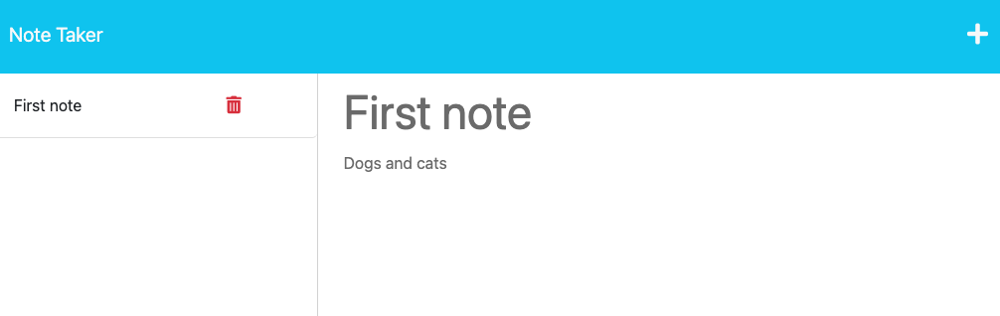

# Note Taker

## Description

Create an application that can be used to write and save notes. Notes will be saved to and retrieved from a JSON file.

## Table of Contents

- [Installation](#installation)
- [Usage](#usage)
- [Tests](#tests)
- [Questions](#questions)

## Installation

To install dependencies:
```npm i```

## Usage

To run application:
```npm start```

Creating a note and viewing the note:



---

## Tests

No tests

## Questions

Take a look at my other projects: [GitHub Profile](https://github.com/matthkang)

You can reach me via email at: [matthkang@gmail.com](mailto:matthkang@gmail.com)